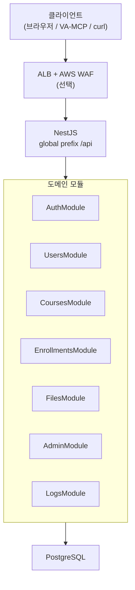

# [KT Tech up] 사이버 보안 2기 TEAM 304

### 팀장: 이윤재 / 팀원: 김태우, 윤지훈, 최민준

의도적 취약점이 포함된 **수강신청 컨셉의 백엔드 서버**입니다.  
수강신청 사이트 라는 컨셉에서 다양한 웹 취약점 공격을 테스트 해 볼 수 있도록 로그인, 수강신청, 강의목록등의 기능들이, OWASP Top 10:2025 시나리오로 API·문서에 정의되어 있습니다.

| 항목          | 내용                                         |
| ------------- | -------------------------------------------- |
| 스택          | NestJS 11, TypeORM, PostgreSQL, Swagger      |
| 패키지 매니저 | **npm**                                      |
| API 베이스    | `https://<도메인>/api` _(배포 후 기입)_      |
| API 문서      | `https://<도메인>/api-docs` _(배포 후 기입)_ |

UI는 [broken_regist_frontend](https://github.com/KTTechUp-Team304/broken_regist_frontend) README를 참고하세요.

---

## 백엔드 아키텍처

배포 기준 요청 처리 흐름입니다. 브라우저·프론트는 동일 출처 `/api`로 호출하고, 리버스 프록시·WAF는 인프라 레이어에서 앞단에 둡니다.



### 레이어 역할

| 레이어     | 경로                | 역할                                                             |
| ---------- | ------------------- | ---------------------------------------------------------------- |
| **진입점** | `src/main.ts`       | 글로벌 prefix `api`, Swagger `/api-docs`, 포트 `PORT`(기본 4000) |
| **구성**   | `src/app.module.ts` | Config·TypeORM·도메인 모듈 조립                                  |
| **도메인** | `src/<domain>/`     | `*.controller` → `*.service` → TypeORM `entities`                |
| **공통**   | `src/common/`       | JWT 가드, 예외 필터, `@CurrentUser()` 등                         |
| **설정**   | `src/config/`       | DB 연결(`typeorm.config.ts`)                                     |
| **문서**   | `docs/`             | API 목록·공격 시나리오·시드·ERD                                  |

### 인증·권한 (API 관점)

| 항목     | 동작                                                               |
| -------- | ------------------------------------------------------------------ |
| 로그인   | `POST /api/auth/login` → Access JWT + Refresh(HttpOnly 쿠키)       |
| 회원가입 | `POST /api/auth/register` — `student`만 생성                       |
| 갱신     | `POST /api/auth/refresh`                                           |
| 보호 API | `JwtAuthGuard` + (일부 엔드포인트) **의도적으로 느슨한 role 검사** |
| 비밀번호 | 평문 → SHA-256(hex) 저장                                           |

역할: `public` · `student` · `professor` · `admin` (`docs/api-list.txt` 참고).

### 도메인 모듈 요약

| 모듈          | 대표 API                   | 설명                                               |
| ------------- | -------------------------- | -------------------------------------------------- |
| `auth`        | `/api/auth/*`              | 로그인·회원가입·refresh·me                         |
| `users`       | `/api/users/*`             | 프로필·역할 (IDOR 시나리오)                        |
| `courses`     | `/api/courses/*`           | 강의 목록·상세·가시성                              |
| `enrollments` | `/api/enrollments/*`       | 수강신청·취소·내 수강                              |
| `files`       | `/api/courses/:id/files/*` | 강의 자료·다운로드                                 |
| `admin`       | `/api/admin/*`             | 대시보드·강의·사용자 관리                          |
| `logs`        | _(엔티티)_                 | 감사·에러 로그 (일부 HTTP 미노출, 문서 시나리오용) |

---

## API·학습 문서

배포된 Swagger와 아래 정적 문서를 함께 사용합니다. **취약점 재현·WAF 실험의 기준**은 `api-docs.txt`와 `vulnerability-matrix.md`입니다.

| 문서                                                                           | 용도                                            |
| ------------------------------------------------------------------------------ | ----------------------------------------------- |
| [docs/api-list.txt](docs/api-list.txt)                                         | 전체 API·역할(role) 목록                        |
| [docs/api-docs.txt](docs/api-docs.txt)                                         | 요청/응답, **공격 시나리오**, 취약 노출 포인트  |
| [docs/vulnerability-matrix.md](docs/vulnerability-matrix.md)                   | API × 취약점 매트릭스 (구현 여부·페이로드 예시) |
| [docs/seed/seed-mock-data.sql](docs/seed/seed-mock-data.sql)                   | 교수·관리자·강의 시드                           |
| [docs/erd/course-registration-erd-v1.sql](docs/erd/course-registration-erd-v1.sql) | PostgreSQL 스키마                             |

Swagger UI에서 Bearer 토큰을 넣어 보호 API를 호출할 수 있습니다.

### 역할별 대표 엔드포인트

| 구분        | 메서드·경로               | role                                      |
| ----------- | ------------------------- | ----------------------------------------- |
| 로그인      | `POST /api/auth/login`    | public                                    |
| 강의 목록   | `GET /api/courses`        | student+                                  |
| 수강신청    | `POST /api/enrollments`   | student                                   |
| 내 수강     | `GET /api/enrollments/me` | student                                   |
| 관리자 통계 | `GET /api/admin`          | admin _(문서상, 가드 누락 시나리오 포함)_ |
| 사용자 목록 | `GET /api/admin/users`    | admin                                     |

상세·OWASP별 시나리오는 `api-docs.txt`를 따릅니다.

---

## 디렉토리 구조

```
broken_regist_backend/
├── docs/
│   ├── api-list.txt
│   ├── api-docs.txt
│   ├── vulnerability-matrix.md
│   ├── erd/
│   │   ├── course-registration-erd-expansion.md
│   │   └── course-registration-erd-v1.sql
│   └── seed/
│       └── seed-mock-data.sql
├── src/
│   ├── main.ts
│   ├── app.module.ts
│   ├── config/
│   │   └── typeorm.config.ts
│   ├── common/
│   │   ├── guards/jwt-auth.guard.ts
│   │   ├── filters/http-exception.filter.ts
│   │   └── decorators/current-user.decorator.ts
│   ├── auth/
│   ├── users/
│   ├── professors/
│   ├── courses/
│   ├── enrollments/
│   ├── files/
│   ├── admin/
│   └── logs/
├── test/                     # e2e (도메인별 *.e2e-spec.ts)
├── docker-compose.yml        # PostgreSQL (로컬)
├── .env.example
└── README.md
```

도메인 폴더 공통 패턴: `*.module.ts` · `*.controller.ts` · `*.service.ts` · `entities/` · `dto/`

---

## 목데이터·테스트 계정

회원가입 API로는 **`student`만** 생성됩니다. 교수·관리자·강의는 시드 데이터로만 존재합니다.

```
users (professor|admin)  →  professors (user_id FK)  →  courses (professor_id FK)
```

### 시드 적용 (배포·로컬 공통)

PostgreSQL에 접속 가능한 환경에서:

```bash
psql -U broken_regist -d broken_regist -f docs/seed/seed-mock-data.sql
# 로컬 Docker 예시
docker compose exec -T postgres psql -U broken_regist -d broken_regist \
  < docs/seed/seed-mock-data.sql
```

| 테이블       | 개수 | 내용                                       |
| ------------ | ---- | ------------------------------------------ |
| `users`      | 6    | 교수 5 + 관리자 1                          |
| `professors` | 5    | 교수 프로필                                |
| `courses`    | 15   | 노출 10 + 숨김 실습 5 (`is_visible=false`) |

### 로그인 계정

| username                 | role      | 비밀번호(평문) |
| ------------------------ | --------- | -------------- |
| `prof.kim` ~ `prof.jung` | professor | `prof123`      |
| `admin`                  | admin     | `admin123`     |

| username    | 교수명        | 노출 강의        | 숨김 실습 |
| ----------- | ------------- | ---------------- | --------- |
| `prof.kim`  | 리누스 토발즈 | CS101, CS201     | CS999     |
| `prof.lee`  | 앨런 튜링     | MATH101, MATH201 | CS998     |
| `prof.park` | 그레이스 호퍼 | EE101, EE201     | CS997     |
| `prof.choi` | 데니스 리치   | BUS101, BUS201   | CS996     |
| `prof.jung` | 도널드 커누스 | HUM101, CS520    | CS995     |

재적용 시 `docs/seed/seed-mock-data.sql` 상단 **cleanup** 주석을 해제한 뒤 실행하세요 (`username` unique 충돌 방지).

---

## WAF 실험 시나리오

EC2 앞단 **AWS WAF**를 두고, **동일 HTTP 요청**을 WAF OFF → ON으로 반복합니다.  
[프론트 README § WAF](https://github.com/KTTechUp-Team304/broken_regist_frontend#waf-실험-시나리오)는 UI·Network 탭 관점, 여기서는 **API·서버 응답** 관점입니다.

| Phase | WAF | API에서 확인할 것                                                 |
| ----- | --- | ----------------------------------------------------------------- |
| **A** | OFF | `api-docs.txt` 시나리오대로 200/취약 본문·스택 노출 등 재현       |
| **B** | ON  | 동일 요청이 403 등으로 **엣지에서 차단**되는지, 앱까지 도달하는지 |

### 시나리오 예시 (API 기준)

| #   | 요청 예                               | WAF OFF                      | WAF ON                                     |
| --- | ------------------------------------- | ---------------------------- | ------------------------------------------ |
| 1   | `POST /api/auth/login` 정상 body      | 200 + 토큰                   | 200 유지                                   |
| 2   | `GET /api/courses` (Bearer)           | 200 + 목록                   | 200 유지                                   |
| 3   | SQLi 패턴 query/body (`api-docs.txt`) | DB/앱 오류 또는 우회         | WAF 차단 가능                              |
| 4   | 비정상 경로·헤더 (`/api/../` 등)      | 404/500 또는 통과            | 엣지 차단                                  |
| 5   | `GET /api/admin` (student 토큰)       | **앱층** BOLA/권한 우회 가능 | WAF 통과 후에도 앱 취약 — 레이어 구분 기록 |

**기록 권장**: curl/Postman 요청·응답, WAF CloudWatch sampled requests, Nest 로그, `docs/vulnerability-matrix.md` 체크.

> WAF가 막아도 애플리케이션 취약점은 남을 수 있습니다. Phase B에서 “차단됨”과 “앱까지 도달”을 구분해 적으세요.

---

## 로컬에서 실행하기

배포본과 동일 API를 개발 PC에서 띄울 때 사용합니다.

### 요구 사항

- Node.js 20+
- npm 10+
- Docker + Docker Compose (PostgreSQL)

### 실행

```bash
npm install
cp .env.example .env
docker compose up -d postgres
docker compose exec -T postgres psql -U broken_regist -d broken_regist \
  < docs/seed/seed-mock-data.sql
npm run start:dev
```

| URL                            | 설명    |
| ------------------------------ | ------- |
| http://localhost:4000/api      | API     |
| http://localhost:4000/api-docs | Swagger |

프론트 연동: [broken_regist_frontend](https://github.com/KTTechUp-Team304/broken_regist_frontend) — 로컬 Next가 `/api`를 `localhost:4000`으로 프록시합니다.

### 명령어

```bash
npm run start:dev    # 개발 (watch)
npm run build        # 빌드
npm run start:prod   # dist/main.js
npm run test:e2e     # e2e 전체
npm run lint         # ESLint
docker compose down  # DB 중지
```

---

## 관련 저장소

| 저장소                                                                               | 설명                |
| ------------------------------------------------------------------------------------ | ------------------- |
| [broken_regist_frontend](https://github.com/KTTechUp-Team304/broken_regist_frontend) | Next.js UI          |
| [VA_MCP](https://github.com/KTTechUp-Team304/VA_MCP)                                 | API 취약점 점검 MCP |

## 개발자용

기능 추가·PR·e2e 작성 규칙:

1. `docs/api-list.txt`, `docs/api-docs.txt` 스펙 확인
2. `src/<domain>` 구현 + Swagger DTO
3. `test/<domain>/*.e2e-spec.ts` — 정상 + 취약 시나리오

```bash
npm run test:e2e
npm run test:e2e:file -- test/auth/auth.e2e-spec.ts
```

## 주의

교육용 **의도적 취약 API**입니다. 공개 배포 시 IP 제한·WAF·모니터링·비밀번호 로테이션을 적용하세요. 프로덕션 서비스에 그대로 사용하지 마세요.
