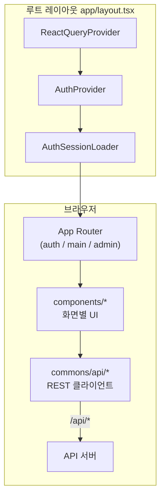
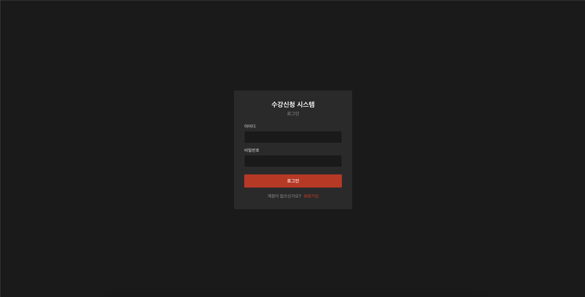
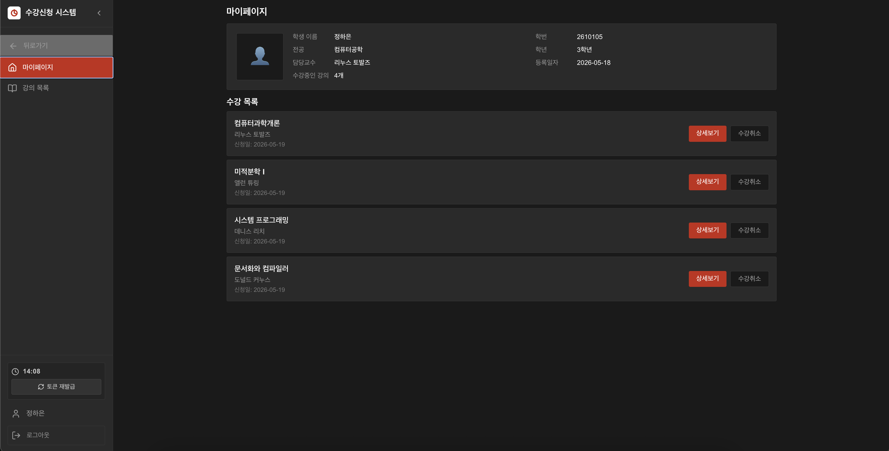
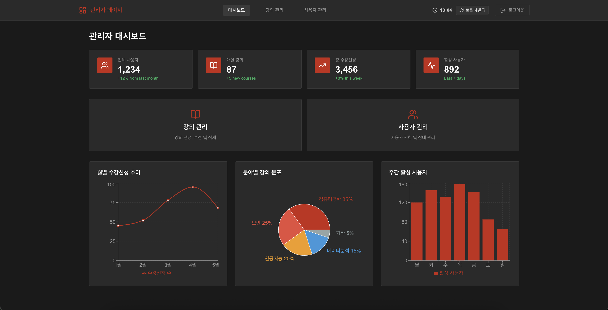

# [KT Tech up] 사이버 보안 2기 TEAM 304

### 팀장: 이윤재 / 팀원: 김태우, 윤지훈, 최민준

의도적 취약점이 포함된 **수강신청 웹 프론트엔드**입니다.  
수강신청 사이트 라는 컨셉에서 다양한 웹 취약점 공격을 테스트 해 볼 수 있습니다.

| 항목          | 내용                                                                   |
| ------------- | ---------------------------------------------------------------------- |
| 스택          | Next.js 14 (App Router), TypeScript, TanStack React Query, CSS Modules |
| 패키지 매니저 | **Yarn**                                                               |
| 배포 URL      | `https://<도메인>/` _(배포 후 기입)_                                   |

API·DB·인프라는 [broken_regist_backend](https://github.com/KTTechUp-Team304/broken_regist_backend) README를 참고하세요.

---

## 프론트엔드 아키텍처

배포 기준으로 브라우저에 내려가는 구조입니다. API 서버는 동일 도메인의 `/api` 경로로 호출하며, 상세 연동·프록시는 백엔드/인프라 문서에서 다룹니다.



### 레이어 역할

| 레이어     | 경로              | 역할                                                      |
| ---------- | ----------------- | --------------------------------------------------------- |
| **라우팅** | `src/app/`        | URL·레이아웃 그룹. `(auth)` 공개, `(main)`·`(admin)` 보호 |
| **UI**     | `src/components/` | 페이지별 화면·CSS Module                                  |
| **공통**   | `src/commons/`    | API 호출, 인증 토큰, React Query·Auth 컨텍스트            |
| **가드**   | `AuthGuard`       | 보호 경로에서 토큰·만료 검사 후 미인증 시 로그인 이동     |
| **셸**     | `MainShell`       | 사이드바·`SessionTimer` 등 로그인 후 공통 chrome          |

### 라우트 그룹

| 그룹      | 경로 예                   | 레이아웃                      |
| --------- | ------------------------- | ----------------------------- |
| `(auth)`  | `/login`, `/register`     | 인증 전용, 가드 없음          |
| `(main)`  | `/dashboard`, `/course/*` | `AuthGuard` + `MainShell`     |
| `(admin)` | `/admin/*`                | 관리자 전용 셸 (`role=admin`) |

### 클라이언트 상태·인증 (프론트 관점)

- **Access Token**: `localStorage` → `auth-fetch`가 `Authorization: Bearer` 부여
- **Refresh**: HttpOnly 쿠키 기반(브라우저가 자동 전송), 만료 시 `SessionTimer`·가드가 로그인 유도
- **데이터**: React Query로 목록·상세 캐시; 화면별 `*-api.ts` 모듈이 `/api/...` 호출

역할별 진입: 로그인 성공 후 `admin` → `/admin`, 그 외 → `/dashboard`.

---

## 화면 캡처

배포 URL 기준 스크린샷입니다. 이미지는 `docs/screenshots/`에 두고 아래 경로를 맞춥니다.

| 화면            | 경로                 | 파일                                   |
| --------------- | -------------------- | -------------------------------------- |
| 로그인          | `/login`             | `docs/screenshots/login.png`           |
| 회원가입        | `/register`          | `docs/screenshots/register.png`        |
| 대시보드        | `/dashboard`         | `docs/screenshots/dashboard.png`       |
| 강의 목록       | `/course`            | `docs/screenshots/course-list.png`     |
| 강의 상세       | `/course/[id]`       | `docs/screenshots/course-detail.png`   |
| 강의 자료       | `/course/[id]/files` | `docs/screenshots/course-files.png`    |
| 관리자 대시보드 | `/admin`             | `docs/screenshots/admin-dashboard.png` |
| 강의 관리       | `/admin/courses`     | `docs/screenshots/admin-courses.png`   |
| 사용자 관리     | `/admin/users`       | `docs/screenshots/admin-users.png`     |

### 로그인



### 대시보드 (학생·교수)



### 관리자 대시보드



---

## 디렉토리 구조

```
broken_regist_frontend/
├── docs/
│   └── screenshots/          # README용 화면 캡처
├── public/
├── src/
│   ├── app/
│   │   ├── layout.tsx        # 전역 Provider
│   │   ├── page.tsx          # / → /dashboard 리다이렉트
│   │   ├── globals.css
│   │   ├── (auth)/
│   │   │   ├── login/page.tsx
│   │   │   └── register/page.tsx
│   │   ├── (main)/
│   │   │   ├── layout.tsx    # AuthGuard + MainShell
│   │   │   ├── dashboard/page.tsx
│   │   │   └── course/
│   │   │       ├── page.tsx
│   │   │       ├── [courseId]/page.tsx
│   │   │       └── [courseId]/files/page.tsx
│   │   └── (admin)/
│   │       ├── layout.tsx
│   │       └── admin/
│   │           ├── page.tsx
│   │           ├── courses/page.tsx
│   │           ├── courses/[courseId]/page.tsx
│   │           └── users/page.tsx
│   ├── commons/
│   │   ├── api/              # auth-api, courses-api, admin-api, auth-fetch
│   │   ├── auth/             # 토큰·공개 경로
│   │   ├── logo/
│   │   └── providers/
│   │       ├── auth-context/ # AuthProvider, AuthGuard, 세션 로더
│   │       └── react-query/
│   └── components/
│       ├── login/
│       ├── register/
│       ├── dashboard/
│       ├── courses/          # 목록, detail, files
│       ├── admin/
│       └── layout/           # main-shell, session-timer
├── next.config.mjs
├── package.json
└── README.md
```

| `commons/api` 파일 | 화면에서 쓰는 대표 API               |
| ------------------ | ------------------------------------ |
| `auth-api.ts`      | 로그인, 회원가입, 내 정보, 수강 목록 |
| `courses-api.ts`   | 강의 목록·상세, 수강신청·취소, 자료  |
| `admin-api.ts`     | 관리자 대시보드, 강의·사용자 CRUD    |
| `auth-fetch.ts`    | Bearer·refresh 공통 fetch            |

---

## WAF 실험 시나리오

EC2 앞단에 **AWS WAF**를 두고, 동일한 브라우저·UI 조작을 **WAF OFF → ON** 순으로 반복하는 실습입니다.  
인프라 구성·규칙 정의는 백엔드/운영 문서에서 관리하고, 여기서는 **프론트에서 관찰할 현상**만 정리합니다.

| Phase | WAF | 프론트에서 확인할 것                                                     |
| ----- | --- | ------------------------------------------------------------------------ |
| **A** | OFF | 의도적 취약 시나리오가 UI·네트워크 탭에서 그대로 드러나는지 (베이스라인) |
| **B** | ON  | 동일 조작 시 요청이 차단되거나 응답 코드·메시지가 달라지는지             |

### 시나리오 예시

| #   | UI 동작                                          | WAF OFF (관찰)           | WAF ON (관찰)                             |
| --- | ------------------------------------------------ | ------------------------ | ----------------------------------------- |
| 1   | 정상 로그인 → 대시보드                           | 로그인·목록 정상         | 동일하게 동작 (오탐 없음)                 |
| 2   | 수강신청·강의 조회                               | 200, 데이터 표시         | 정상 유지                                 |
| 3   | 입력란·쿼리에 SQLi 패턴 _(백엔드 시나리오 참고)_ | 오류 또는 취약 반응 가능 | 403 등 차단, UI 에러 메시지 변화          |
| 4   | 비정상 경로·스크립트 페이로드                    | 통과 또는 앱 오류        | WAF 차단, Network 탭에서 차단 응답        |
| 5   | 관리자 `/admin` 접근                             | `admin`만 진입           | 역할 검사는 앱층 — WAF와 별개로 동작 이해 |

**기록 권장**: 브라우저 DevTools Network(상태 코드·응답 본문), 화면 스크린샷, WAF sampled request 로그를 짝지어 Phase A/B 표를 채웁니다.

> WAF는 경계 방어입니다. 차단돼도 애플리케이션 취약점이 사라지지는 않습니다.

## 관련 저장소

| 저장소                                                                             | 설명                                 |
| ---------------------------------------------------------------------------------- | ------------------------------------ |
| [broken_regist_backend](https://github.com/KTTechUp-Team304/broken_regist_backend) | API, 시드, 취약점·공격 시나리오 문서 |
| [VA_MCP](https://github.com/KTTechUp-Team304/VA_MCP)                               | API 취약점 점검 MCP (선택)           |

## 주의

취약점 시뮬레이션용 애플리케이션 입니다. 배포 URL·접근 권한·WAF는 운영 정책에 맞게 제한하세요.
